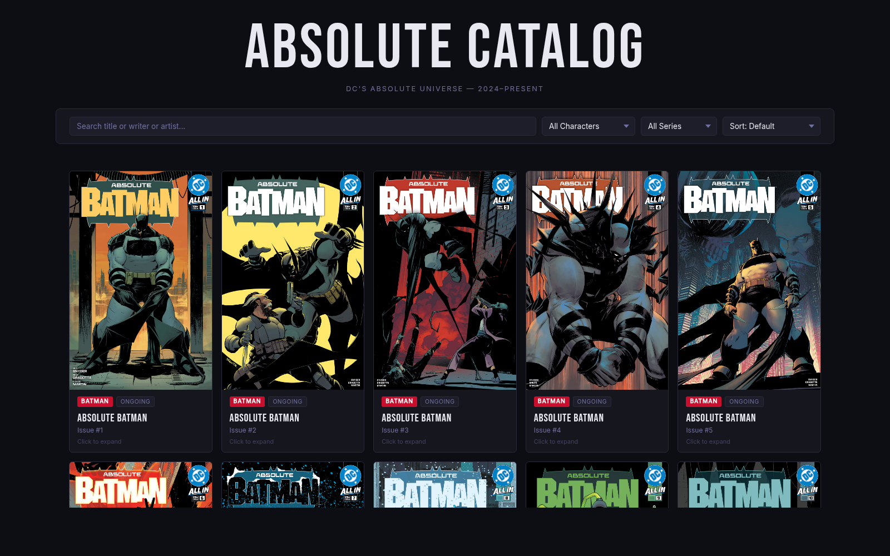
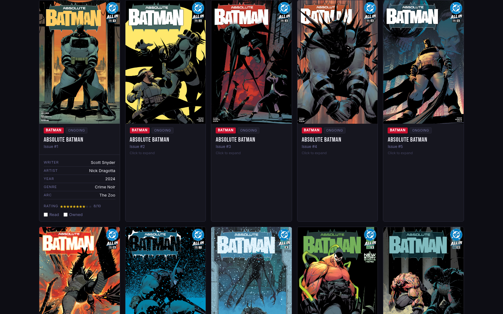
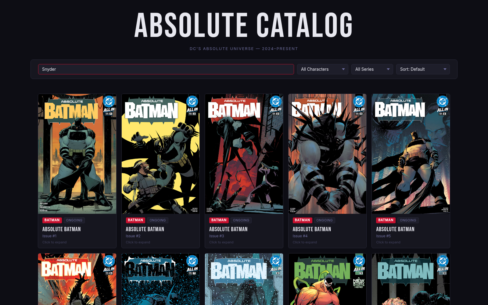

# Absolute Catalog

A personal catalog of DC's Absolute Universe — every issue across six ongoing series, with cover art, metadata, star ratings, and live filtering/sorting. Built with vanilla HTML, CSS, and JavaScript.



---

## About

The Absolute Universe is DC's 2024 reimagining of its core heroes — Batman, Wonder Woman, Superman, Flash, Green Lantern, and Martian Manhunter — as standalone continuities with darker tones and new origins. This catalog tracks all 92 issues published so far, letting me browse, rate, and filter them by character, series status, and more.

---

## Features

- **Expandable cards** — click any card to reveal writer, artist, arc name, genre, release year, and user controls.
- **Live search** — search by title, writer, or artist; results update on every keystroke.
- **Filtering** — narrow the catalog by character or by series status (Ongoing / Limited Series).
- **Sorting** — sort by issue number, release year, or your own rating (highest first).
- **Star rating** — rate any issue 1–10. Ratings persist across filter changes within the session.
- **Read / Owned toggles** — track which issues you've read and which you own.



---

## Tech

- **HTML** for structure and a hidden card template used as a blueprint.
- **CSS** with custom properties for theming, CSS Grid for the responsive card layout, and a custom-styled select dropdown.
- **JavaScript** for cloning the template, filtering/sorting the data array, and wiring up user interactions — no frameworks, no APIs, no build step.



---

## File Structure

```
Absolute_Catalog/
├── index.html       # Page structure + hidden card template
├── style.css        # Theme, grid layout, and card styles
├── scripts.js       # Rendering, filtering, sorting, ratings
├── data.js          # Array of 92 comic objects
└── assets/          # Screenshots and images
```

---

## Running Locally

Because the project is static HTML/CSS/JS, you can open `index.html` directly in a browser. For the cleanest experience (and to avoid any file-protocol quirks), run a simple local server:

```bash
python3 -m http.server 8080
```

Then open `http://localhost:8080` in your browser.

---

## Data

The catalog is driven by a single JavaScript array in `data.js` — 92 objects, one per issue. Each object has 12 fields: `title`, `character`, `issue`, `writer`, `artist`, `arcName`, `releaseYear`, `status`, `genre`, `coverImage`, `rating`, `read`, `owned`.

The data is stored in a `.js` file (as a `const` array) rather than JSON so it loads via a `<script>` tag without CORS issues when running from the file system.

---

## Credits

- Cover art sourced from DC's official CDN.
- Built from the SEA Stage 2 starter template.
